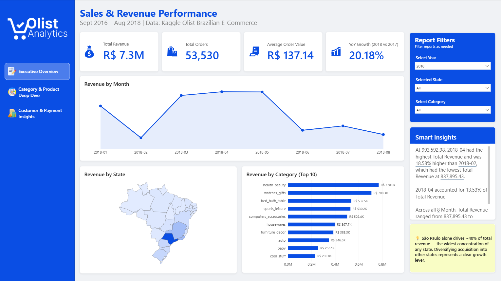
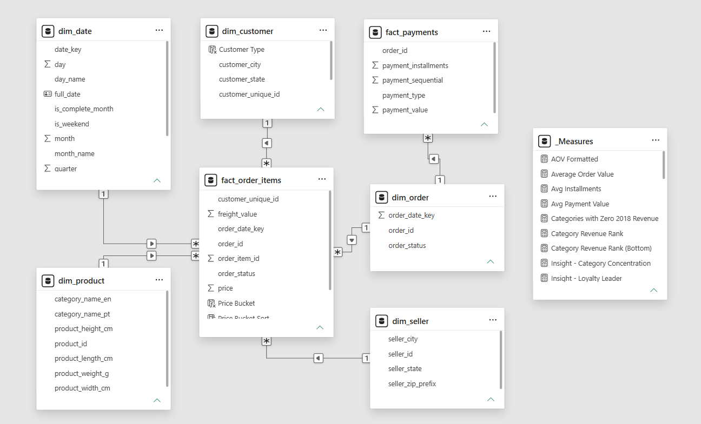
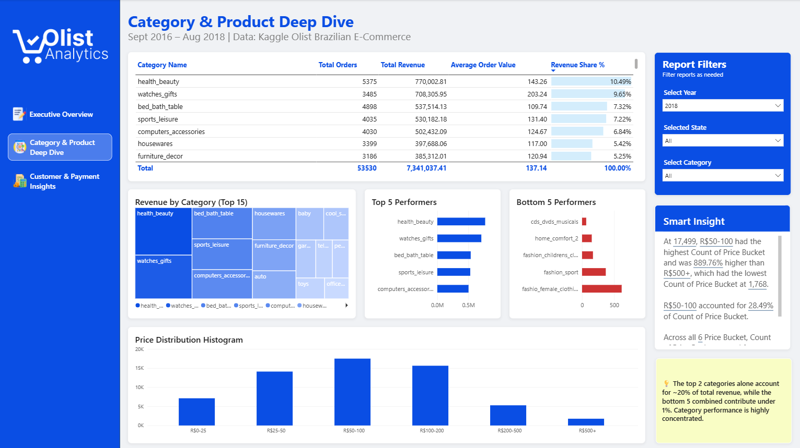
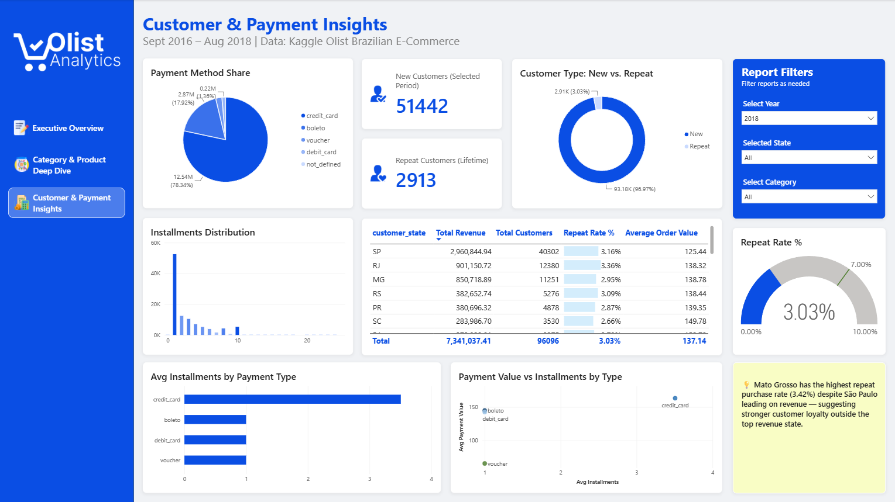

# Olist E-Commerce — Sales & Revenue Performance Dashboard

A 3-page Power BI dashboard analyzing sales, category, and customer/payment performance for Olist, a Brazilian multi-vendor e-commerce marketplace. Built end-to-end from raw CSVs — data cleaning, star schema design, DAX modeling, and dashboard design.

**[.pbix Download ▸](dashboard/olist_sales_dashboard.pbix)**

> **About this project:** I'm a BI Developer and Reporting Analyst with 12+ years building automated reporting pipelines and Power BI dashboards in production, for clients including British American Tobacco Bangladesh, Arnott's Australia, and TOLL Australia. This project is a from-scratch demonstration of that same end-to-end process on a public dataset — raw data with real quality problems, a fully modeled star schema, and dashboards, with every DAX measure validated against independent SQL. Documented the way I'd document a production deliverable.
>
> Microsoft certified: DP-600 (Fabric Analytics Engineer Associate), PL-300 (Power BI Data Analyst Associate).
>
> [Connect on LinkedIn](https://www.linkedin.com/in/siam-sadman)



---

## Why This Dataset

I chose the [Olist Brazilian E-Commerce dataset](https://www.kaggle.com/datasets/olistbr/brazilian-ecommerce) over a simpler, single-table dataset deliberately. It's one of the most commonly used benchmark datasets in the BI field specifically because it mirrors real business complexity: multiple related tables at different grains, inconsistent category naming, missing translations, and orphaned records. The goal of this project wasn't to make a pretty chart — it was to demonstrate the full analyst workflow: clean messy data, model it correctly, justify business logic decisions, and communicate the result clearly. Those skills transfer to any market or industry, not just Brazilian e-commerce.

---

## Tech Stack

- **SQL Server** (Dockerized) — staging, transformation, star schema
- **Python (pandas)** — initial data cleaning (null handling, placeholder values)
- **Power BI Desktop** — data modeling, DAX, dashboard design
- **Navicat Premium** — database administration, CSV import

---

## Data Model

A star schema with two fact tables at different grains, connected through a shared `dim_order` bridge table:



**Fact tables:**
- `fact_order_items` — grain: one row per order line item (product, seller, price, freight)
- `fact_payments` — grain: one row per payment installment record

**Dimensions:** `dim_date`, `dim_customer`, `dim_seller`, `dim_product`, `dim_order`

### Why a bridge table for orders

`fact_order_items` and `fact_payments` share `order_id`, but neither field is unique in either table (multiple items per order, multiple payment records per order). Relating them directly produces an uncontrolled many-to-many relationship, which silently inflates revenue and payment totals depending on query context. `dim_order` sits between them as a proper dimension, so both facts relate to it many-to-one — a clean, predictable star pattern.

---

## Data Quality: What I Found and How I Handled It

Real datasets are messy. Documenting these decisions is, in my view, more valuable to a hiring manager than the charts themselves — it shows how I think, not just what I can build.

| Issue Found | Resolution |
|---|---|
| `customer_id` is order-specific; the same real person gets a new ID per order | Used `customer_unique_id` as the true customer dimension key for all customer-level metrics (repeat rate, unique customer counts) |
| `order_items` ↔ `payments` relationship was many-to-many | Introduced `dim_order` as a bridge dimension; both facts now relate many-to-one |
| 775 orders in `orders` have zero rows in `order_items` (cancelled/unavailable before fulfillment) | Confirmed as expected — these orders are naturally excluded from `fact_order_items`, since the fact grain is order line item |
| 623 products had untranslated (Portuguese-only) category names | Manually mapped 3 missing categories to the translation table |
| 461 orders marked `canceled` still had line items (cancelled after fulfillment began) | Built a primary `Total Revenue` measure that excludes `canceled`/`unavailable` order statuses, alongside a separate `Total Revenue (Gross)` measure for total demand analysis |
| Final month of data (Sept 2018) was incomplete — extracted mid-month | Filtered all trend visuals to complete months only (through Aug 2018), to avoid a misleading "revenue cliff" that doesn't reflect reality |
| Datetime columns initially imported as SQL Server `time` type, silently dropping the date portion | Diagnosed via `INFORMATION_SCHEMA.COLUMNS`, fixed by re-importing with explicit `yyyy-MM-dd HH:mm:ss` format mapping |

---

## Key Modeling Decisions

**Revenue definition.** `Total Revenue` excludes cancelled and unavailable orders to reflect realized business performance. A separate `Total Revenue (Gross)` measure is available for total demand analysis including cancellations. Any ratio measure (e.g., Average Order Value) uses the same filtered population in both numerator and denominator to avoid mismatched comparisons.

**Year-over-year growth.** Rather than an open date-range comparison (which produces misleading results when comparing a partial year against a full year), YoY growth is calculated as a fixed comparison: full calendar year 2018 vs. full calendar year 2017.

**Repeat customer rate.** Calculated on a lifetime basis (has this person ever placed more than one order, regardless of the date filter in view) rather than only within the currently selected period — this avoids understating repeat behavior when a customer's two orders happen to fall in different years.

**Statistical significance threshold.** The "top loyalty state" insight only considers states with at least 500 customers, to avoid highlighting a misleadingly high repeat rate from a small, low-volume state where one or two repeat customers would otherwise dominate the percentage.

---

## Dashboard Pages

### 1. Executive Overview
Top-line KPIs, revenue trend, geographic distribution, and category leaders — the 30-second summary.


### 2. Category & Product Deep Dive
Category performance table, revenue concentration (treemap), top/bottom performers, and price distribution.



### 3. Customer & Payment Insights
Payment method behavior, installment patterns, new vs. repeat customer split, and state-level loyalty comparison.




All three pages share a synced filter panel (Year, State, Category) and include both auto-generated statistical highlights (Power BI Smart Insights) and hand-authored analyst takeaways — the callout boxes are dynamic DAX measures that update live with the applied filters, not static text.

---

## Notable Findings

- **São Paulo drives ~40% of total 2018 revenue** — the widest concentration of any state, and a signal that customer acquisition is heavily weighted toward one region.
- **Revenue is concentrated at the category level too** — the top 2 categories account for ~20% of total revenue, while the bottom 5 combined contribute under 1%.
- **Olist has a very low repeat purchase rate (~3%)**, consistent with its nature as a multi-vendor marketplace without strong platform-level loyalty mechanisms. Interestingly, the state with the strongest repeat behavior (among states with meaningful sample size) is not the state with the most revenue — suggesting loyalty and revenue scale don't move together.
- **Credit card is the platform's de facto financing mechanism** — carrying both the highest average installment count and the highest average order value, while boleto, debit, and voucher payments are overwhelmingly pay-in-full, lower-value transactions.

---

## Repository Structure

```
/olist-sales-dashboard
├── README.md
├── sql/
│   ├── 01_schema.sql          — star schema DDL
│   ├── 02_load_dimensions.sql — dimension population scripts
│   └── 03_load_facts.sql      — fact table population scripts
├── scripts/
│   └── data_cleaning.py       — initial data cleaning
├── dashboard/
│   └── olist_sales_dashboard.pbix
├── images/
│   ├── page1_executive_overview.png
│   ├── page2_category_deep_dive.png
│   ├── page3_customer_payment.png
│   └── data_model.png
```

---

## About

Built by Siam Sadman as part of a portfolio project.

www.linkedin.com/in/siam-sadman
